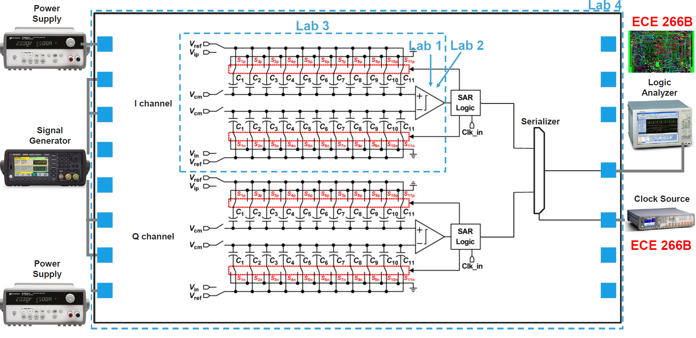
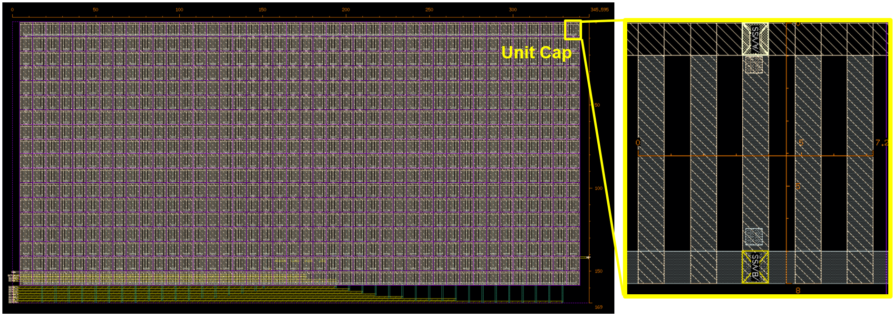
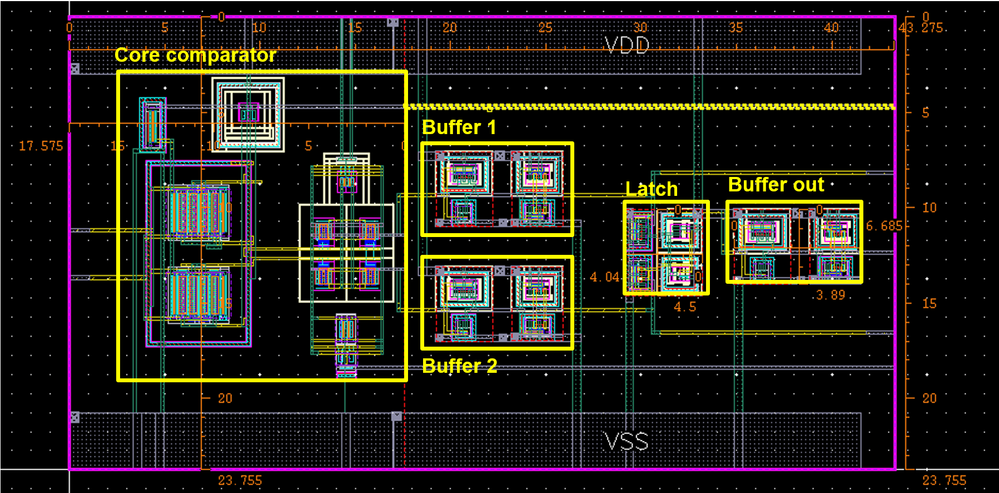
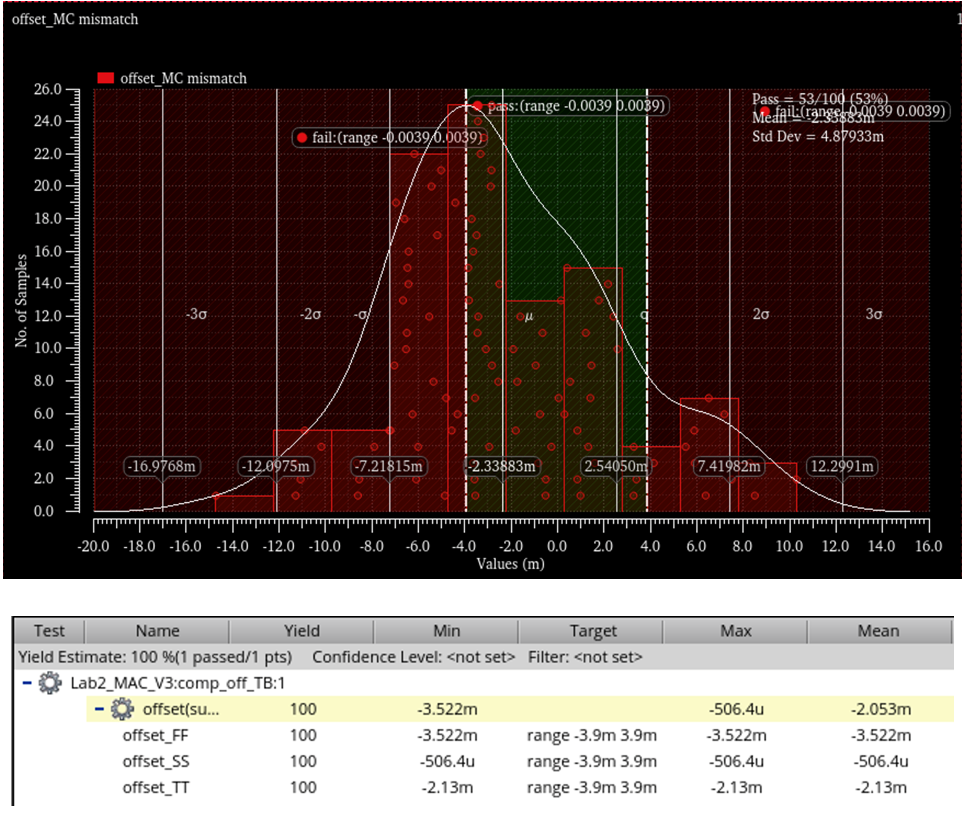
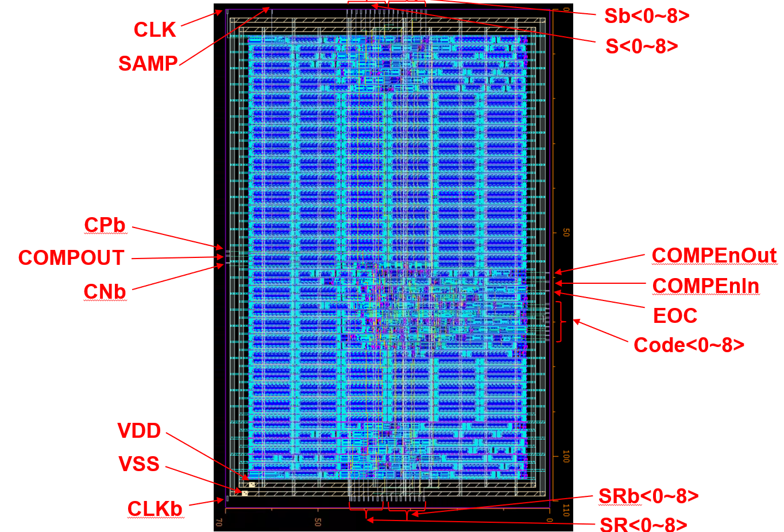
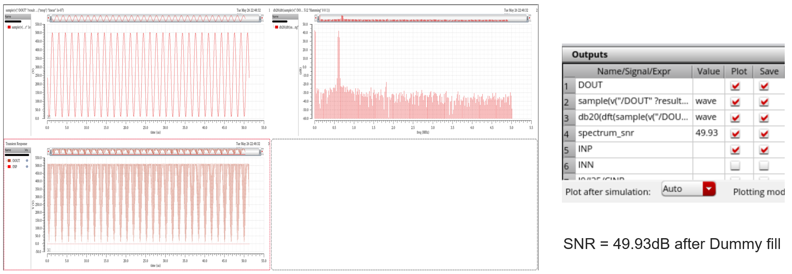
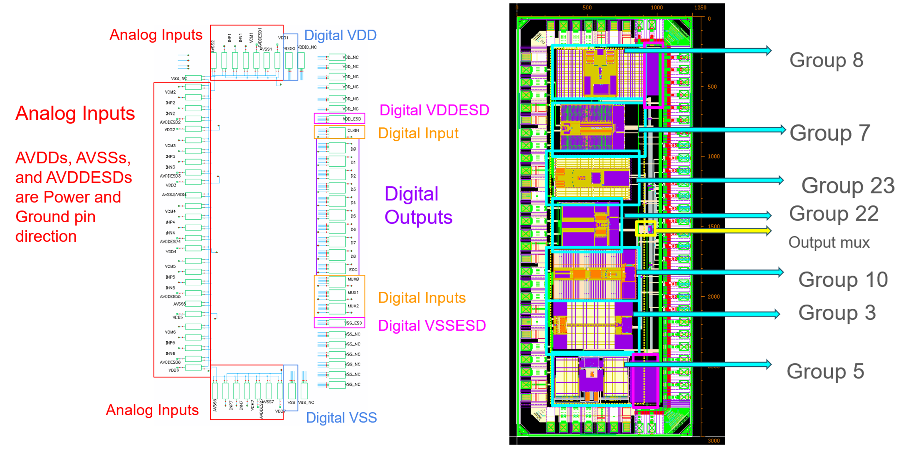

# 9-bit Differential SAR ADC — TSMC 65nm

> Full custom IC design, layout, and post-layout verification of a 9-bit differential Successive Approximation Register (SAR) ADC in TSMC 65nm. Taped out as part of a 7-group collaborative top chip.

---

## Table of Contents

- [Overview](#overview)
- [Specifications](#specifications)
- [Architecture](#architecture)
- [Block-Level Design](#block-level-design)
  - [Bootstrapped Sampling Switch](#bootstrapped-sampling-switch)
  - [Capacitive DAC (CDAC)](#capacitive-dac-cdac)
  - [Comparator](#comparator)
  - [SAR Controller & MUX](#sar-controller--mux)
- [Layout Methodology](#layout-methodology)
- [Verification & Simulation](#verification--simulation)
- [Top-Level Tape-Out](#top-level-tape-out)
- [Tools Used](#tools-used)

---

## Overview

This project implements a **9-bit differential SAR ADC** designed and verified in TSMC 65nm using Cadence Virtuoso. The ADC utilizes a charge-redistribution CDAC architecture, a dynamic comparator engineered for minimal systematic offset, and a fully synthesized digital SAR controller. 

The design was completed as part of a multi-group tape-out project (ECE 266). It was successfully integrated into a **7-ADC top-level chip**[cite: 11], where our team contributed to the global power delivery network, decoupled capacitor (DCAP) placement, and a custom 30-MUX digital output stage[cite: 11].

---

## Specifications

| Parameter | Value |
|---|---|
| Resolution | 9-bit differential |
| Technology | TSMC 65nm |
| SNDR (post-dummy fill, extracted) | **49.93 dB**[cite: 11] |
| SNR (post-dummy fill, extracted) | **49.71 dB**[cite: 10] |
| Comparator Offset (MC Mean) | **-2.33 mV**[cite: 9] |
| Comparator Propagation Delay | **200 ps (TT) / 158 ps (FF)**[cite: 9] |
| CDAC Capacitor Mismatch | **< ±0.2%**[cite: 10] |
| Top-level Integration | 7 independent ADC cores[cite: 11] |
| Power Consumption | 【需要你替换：例如 230 µW】 |

---

## Architecture

The ADC follows a standard **charge-redistribution SAR** architecture:

【需要你替换：在这里插入一张你绘制的系统架构图（System Block Diagram）】

  

---

## Block-Level Design

### Bootstrapped Sampling Switch

**Motivation:** In a standard NMOS sampling switch, the on-resistance R_ON depends on V_GS. As V_IN swings, R_ON changes, introducing signal-dependent distortion that directly degrades SFDR. 
**Implementation:** A bootstrapped network was utilized to dynamically boost the gate voltage in proportion to the input signal, holding V_GS approximately constant regardless of V_IN.

  

  

---

### Capacitive DAC (CDAC)

The CDAC uses a **binary-weighted capacitor array** utilizing MOM capacitors. 

**Layout approach:** Instead of relying on automated scripts, the CDAC array was methodically designed using a **symmetric column-based placement** to ensure exceptional matching and simplify high-layer routing under strict area constraints[cite: 10]. 

**Matching techniques applied:**
*   **Dummy Capacitor Ring:** Extensive dummy capacitors were placed around the outmost boundaries and above LSBs (e.g., bit 0 to 5) to mitigate edge effects[cite: 10].
*   **Parasitic Balancing:** Horizontal M2 wires connecting top nodes were routed *above* dummy devices, while bottom node wires were routed *below*, explicitly matching the coupling capacitance (CC)[cite: 10].
*   **Final Mismatch:** Across all binary-weighted caps, the mismatch was constrained to **< ±0.2%**[cite: 10].

  

---

### Comparator

A dynamic comparator topology was engineered with a strict focus on symmetric layout to minimize systematic mismatch.

**Layout techniques:**
*   **Interdigitation:** Adopted **ABBA and BAAB patterns** for the differential input pair (W=2µm, fingers=2, m=4) to cancel linear process gradients[cite: 8, 9].
*   **Dummy Devices:** Identically sized dummy devices (W=2µm) were placed on the outer edges of the active fingers to maintain identical physical stress environments[cite: 9].
*   **Custom Parasitic Tuning:** Extended the M2 routing of the FP node perpendicular to the guard ring, and the FN node parallel to the guard ring, to perfectly balance the parasitic Capacitance (C) and Coupling Capacitance (CC) to ground[cite: 9].

**Simulation:** ADE XL Monte Carlo (mismatch) with extracted R-C-CC parasitics showed excellent performance:

| Corner | Mean Offset | Propagation Delay |
|--------|------------|------------------|
| **TT** | **-2.33 mV**[cite: 9] | **200.0 ps**[cite: 9] |
| **SS** | -0.50 mV[cite: 9] | 273.5 ps[cite: 9] |
| **FF** | -3.52 mV[cite: 9] | 158.0 ps[cite: 9] |

  

  

---

### SAR Controller & MUX

The digital SAR controller was synthesized using Cadence Genus and place-and-routed in Innovus. 

**30-MUX Output Stage:** To support the 7-ADC top-level tape-out, a custom multiplexing stage was designed. For each of the 10 output bits (9 data bits + 1 EOC), a cascade of two 4-to-1 MUXes and one 2-to-1 MUX was implemented, totaling 30 multiplexers to securely route the selected ADC data to the shared pad ring[cite: 11].

  

---

## Layout Methodology

Consistent layout practices were applied across all blocks:

| Practice | Purpose |
|---|---|
| **Orthogonal Routing** | Odd metals (M1/M3) vertical, Even metals (M2/M4) horizontal for clean DRC[cite: 8]. |
| **Signal Isolation** | Strict separation between the "Quiet Zone" (CDAC & comparator) and "Noisy Zone" (SAR logic)[cite: 10]. |
| **Parasitic Equalization** | Matched trace geometries for FN/FP and INN/INP nets to equalize RC delays[cite: 9]. |
| **Substrate Taps & Rings** | Used guard rings for sensitive analog cores and dense local substrate taps for digital cells (e.g., inverters) to optimize area[cite: 8]. |

**Final ADC footprint:** < 690 µm × 350 µm

---

## Verification & Simulation

Full **R-C-CC** extraction was performed using Calibre xRC prior to post-layout simulations.

*   **SNDR / SNR Verification:** Conducted transient noise simulations on the fully assembled ADC. Even after the performance degradation typically caused by adding dummy metal fillers, the ADC robustly maintained an **SNDR of 49.93 dB** and **SNR of 49.71 dB**[cite: 10, 11].
*   **DRC / LVS:** Passed full-chip Calibre checks, resolving all antenna rules via metal jumpers/bridges.

  

---

## Top-Level Tape-Out

The ADC was successfully integrated into a collaborative **7-ADC top chip**[cite: 11]. 

**My contributions at the top level:**
*   Designed the **global 30-MUX array** for pad-sharing[cite: 11].
*   Floorplanned the central integration, placing the smallest ADC (Group 22) in the center to allocate space for the MUX logic[cite: 11].
*   Placed extensive **Decoupling Capacitors (DCAPs)** in the four large empty corners to stabilize the global VDD/VSS network[cite: 11].
*   Managed the full-chip DRC/LVS closure and the final metal dummy fill process[cite: 11].

  

---

## Tools Used

| Tool | Usage |
|---|---|
| **Cadence Virtuoso** | Schematic entry, custom analog layout |
| **Spectre / ADE L** | Transient, Transient Noise, and FFT spectrum simulation |
| **ADE XL** | Monte Carlo mismatch analysis |
| **Calibre** | DRC, LVS, xRC (R-C-CC extraction) |
| **Cadence Genus** | SAR controller synthesis |
| **Cadence Innovus** | Place-and-route for digital blocks |

---
*9-bit Differential SAR ADC · TSMC 65nm · UC San Diego*
