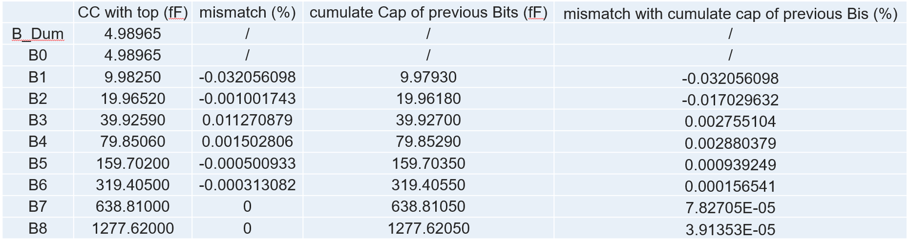
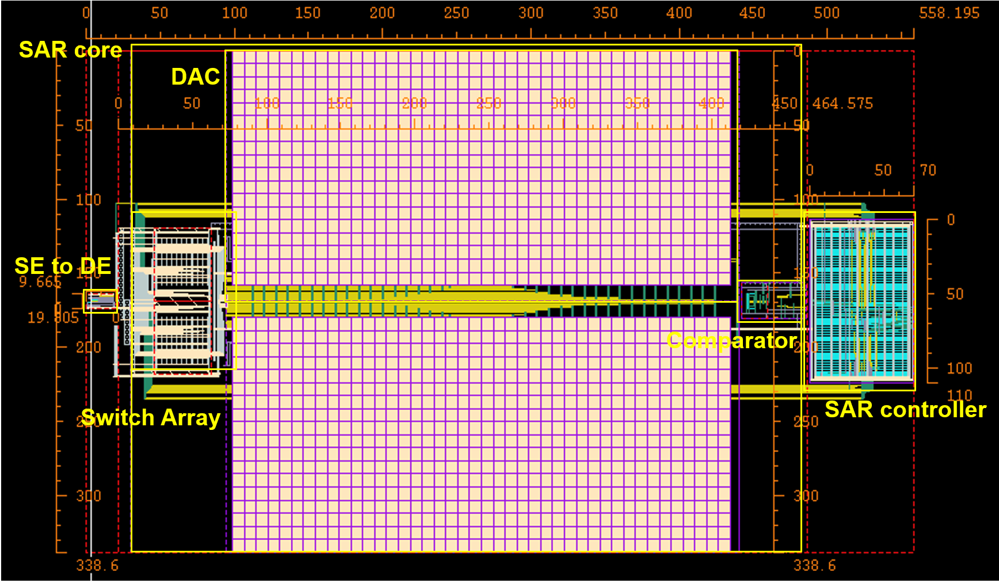
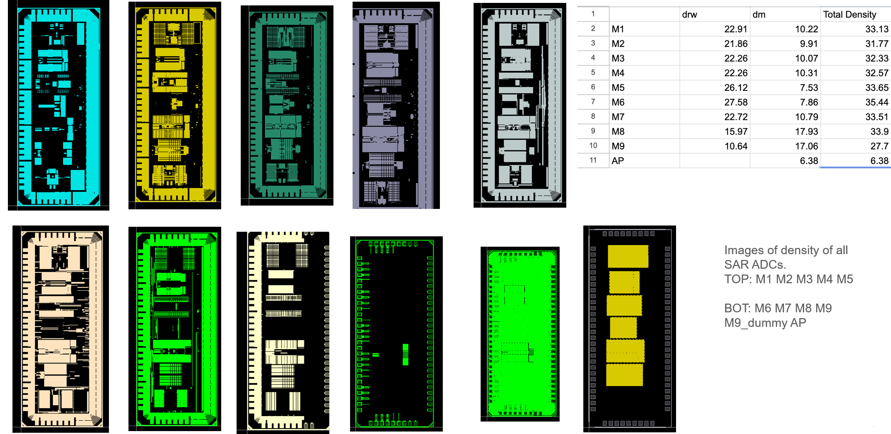

# 9-bit Differential SAR ADC — TSMC 65nm

> Full custom IC design, layout, and post-layout verification of a 9-bit differential Successive Approximation Register (SAR) ADC in TSMC 65nm. Taped out as part of a 7-group collaborative top chip.

---

## Table of Contents

- [Overview](#overview)
- [Specifications](#specifications)
- [Architecture](#architecture)
- [Block-Level Design](#block-level-design)
  - [Capacitive DAC (CDAC)](#capacitive-dac-cdac)
  - [Comparator](#comparator)
  - [SAR Controller & MUX](#sar-controller--mux)
  - [Output Buffers](#output-buffers)
- [Layout Methodology](#layout-methodology)
- [Verification & Simulation](#verification--simulation)
- [Top-Level Tape-Out](#top-level-tape-out)
- [Tools Used](#tools-used)

---

## Overview

This project implements a **9-bit differential SAR ADC** designed and verified in TSMC 65nm using Cadence Virtuoso. The ADC utilizes a charge-redistribution CDAC architecture, a dynamic comparator engineered for minimal systematic offset, and a fully synthesized digital SAR controller. 

The design was completed as part of a multi-group tape-out project (ECE 266). It was successfully integrated into a **7-ADC top-level chip**[cite: 11], where our team contributed to the global power delivery network, decoupled capacitor (DCAP) placement, and a custom 30-MUX digital output stage[cite: 11].

---

## Specifications

| Parameter | Value |
|---|---|
| Resolution | 9-bit differential |
| Technology | TSMC 65nm |
| Supply Voltage | 1 V |
| SNDR (post-dummy fill, extracted) | **49.93 dB** |
| SNR (post-dummy fill, extracted) | **49.71 dB** |
| Comparator Offset (MC Mean) | **-2.33 mV** |
| Comparator Propagation Delay | **200 ps (TT) / 158 ps (FF) / 273 ps (SS)** |
| CDAC Capacitor Mismatch | **< ±0.2%** |
| Top-level Integration | 7 independent ADC cores |
| Power Consumption | 260.7 µW |

---

## Architecture

This design employs a **differential charge-redistribution SAR** architecture. The system block diagram below illustrates the complete signal chain, including the capacitive DAC (CDAC) arrays, dynamic comparator, SAR control logic, and the top-level output multiplexer.

  

### Operational Workflow

The analog-to-digital conversion process operates through a highly efficient binary search algorithm, utilizing charge conservation principles. The workflow is executed in the following phases:

1. **Sampling Phase:** The differential analog input signals ($V_{ip}$ and $V_{in}$) are sampled onto the bottom plates of the CDAC arrays. Simultaneously, the top plates (directly connected to the comparator's inputs) are biased to a stable common-mode voltage ($V_{cm}$). This bottom-plate sampling technique effectively minimizes charge injection and clock feedthrough.
2. **Hold Phase:** The switches connecting the top plates to $V_{cm}$ are opened, leaving the top plates floating and trapping the sampled charge. The bottom plates are then switched, causing the voltage at the floating top plates to shift in proportion to the sampled differential input.
3. **Bit-Cycling (Binary Search):** The SAR logic performs a step-by-step binary search from the Most Significant Bit (MSB) down to the Least Significant Bit (LSB). In each clock cycle:
    * **Comparison:** The dynamic comparator evaluates the polarity of the differential residue voltage at the top plates.
    * **Logic Update:** Based on the comparator's decision (1 or 0), the SAR controller latches the current bit and updates the bottom-plate connection of the corresponding capacitor, switching it to either $V_{ref}$ or Ground.
    * **Charge Redistribution:** This switching action redistributes the charge across the capacitor array, effectively subtracting (or adding) a binary-weighted reference voltage. This feedback loop forces the differential residue voltage at the comparator inputs to rapidly converge toward zero.
4. **Data Output & Serialization:** After completing the 9 comparison cycles, the final 9-bit digital word is locked in the SAR register. To support the top-level tape-out, the digital outputs from multiple ADC channels are routed through a digital multiplexer/serializer for efficient pad-sharing and off-chip readout.

---

## Block-Level Design

### Capacitive DAC (CDAC)

The CDAC uses a **binary-weighted capacitor array** utilizing MOM capacitors. 

**Layout approach:** Instead of relying on automated scripts, the CDAC array was methodically designed using a **symmetric column-based placement** to ensure exceptional matching and simplify high-layer routing under strict area constraints. 

**Matching techniques applied:**
*   **Dummy Capacitor Ring:** Extensive dummy capacitors were placed around the outmost boundaries and above LSBs (e.g., bit 0 to 5) to mitigate edge effects.
*   **Parasitic Balancing:** Horizontal M2 wires connecting top nodes were routed *above* dummy devices, while bottom node wires were routed *below*, explicitly matching the coupling capacitance (CC).
*   **Final Mismatch:** Across all binary-weighted caps, the mismatch was constrained to **< ±0.2%**.

  

  

---

### Comparator

A dynamic comparator topology was engineered with a strict focus on symmetric layout to minimize systematic mismatch.

**Layout techniques:**
*   **Interdigitation:** Adopted **ABBA and BAAB patterns** for the differential input pair (W=2µm, fingers=2, m=4) to cancel linear process gradients.
*   **Dummy Devices:** Identically sized dummy devices (W=2µm) were placed on the outer edges of the active fingers to maintain identical physical stress environments.
*   **Custom Parasitic Tuning:** Extended the M2 routing of the FP node perpendicular to the guard ring, and the FN node parallel to the guard ring, to perfectly balance the parasitic Capacitance (C) and Coupling Capacitance (CC) to ground.

**Simulation:** ADE XL Monte Carlo (mismatch) with extracted R-C-CC parasitics showed excellent performance:

| Corner | Mean Offset | Propagation Delay |
|--------|------------|------------------|
| **TT** | **-2.33 mV** | **200.0 ps** |
| **SS** | -0.50 mV | 273.5 ps |
| **FF** | -3.52 mV | 158.0 ps |

  

  

---

### SAR Controller & MUX

The digital SAR controller implements the binary search algorithm, generating the CDAC switching sequence and capturing the comparator output at each bit cycle.
*   **Design Flow:** The RTL was written in Verilog, synthesized using **Cadence Genus**, and place-and-routed in **Cadence Innovus**.

**30-MUX Output Stage:** To support the 7-ADC top-level tape-out, a custom multiplexing stage was designed. 
*   For each of the 10 output bits (9 data bits + 1 EOC), a cascade of two 4-to-1 MUXes and one 2-to-1 MUX was implemented, resulting in a total of 30 multiplexers to securely route the selected ADC data to the shared pad ring.
*   For signal routing, Metal 6 (M6) was primarily used for horizontal interconnects, while Metals 5 and 7 (M5 and M7) were mainly used for vertical routing.

  

---

### Output Buffers

To drive the long on-chip traces from the SAR ADC digital outputs to the pad ring, a customized buffer array was implemented. Buffers were systematically inserted approximately every 500 µm along long signal paths. This strategy effectively restores signal strength, mitigates antenna effects, and prevents antenna-rule violations across the full chip.

---

## Layout Methodology

Consistent layout practices were applied across all blocks:

| Practice | Purpose |
|---|---|
| **Orthogonal Routing** | Odd metals (M1/M3) vertical, Even metals (M2/M4) horizontal for clean DRC. |
| **Signal Isolation** | Strict separation between the "Quiet Zone" (CDAC & comparator) and "Noisy Zone" (SAR logic). |
| **Parasitic Equalization** | Matched trace geometries for FN/FP and INN/INP nets to equalize RC delays. |
| **Substrate Taps & Rings** | Used guard rings for sensitive analog cores and dense local substrate taps for digital cells (e.g., inverters) to optimize area. |

**Final ADC footprint:** < 690 µm × 350 µm

  

---

## Verification & Simulation

Full **R-C-CC** extraction was performed using Calibre xRC prior to post-layout simulations.

*   **SNDR / SNR Verification:** Conducted transient noise simulations on the fully assembled ADC. Even after the performance degradation typically caused by adding dummy metal fillers, the ADC robustly maintained an **SNDR of 49.93 dB** and **SNR of 49.71 dB**.
*   **DRC / LVS:** Passed full-chip Calibre checks, resolving all antenna rules via metal jumpers/bridges.

  

---

## Top-Level Tape-Out

The ADC was successfully integrated into a collaborative **7-ADC top chip**.

**My Primary Contributions:**
*   **Top-Level Layout (Solo-Routed):** Independently executed the full-chip layout integration. Arranged the 7 SAR ADC blocks vertically, strategically rotating the largest blocks (Groups 8 and 5) to the top and bottom to utilize available pin locations. Positioned the smallest block (Group 22) in the center to allocate sufficient space for the MUX circuitry and signal routing.
*   **Pad Ring Planning:** Architected the I/O pad ring, placing analog input, power supply, and ground pads on the left, top, and bottom sides, while centralizing digital IO pads on the right side. Maintained a strict 90 µm center-to-center spacing between adjacent pads.
*   **DRC/LVS & Density Verification:** Independently ran and achieved full-chip DRC and LVS closure. Executed metal dummy fill scripts on all metal layers (M1-M9, AP) to satisfy strict foundry density rules, and successfully managed waiver requests for known standard-cell density errors on M8 and M9.
*   **Collaborative Design:** Participated in global power delivery network planning, placing massive Decoupling Capacitors (DCAPs) in four large empty corners to stabilize the VDD/VSS network.

  
  

---

## Tools Used

| Tool | Usage |
|---|---|
| **Cadence Virtuoso** | Schematic entry, custom analog layout |
| **Spectre / ADE L** | Transient, Transient Noise, and FFT spectrum simulation |
| **ADE XL** | Monte Carlo mismatch analysis |
| **Calibre** | DRC, LVS, xRC (R-C-CC extraction) |
| **Cadence Genus** | SAR controller synthesis |
| **Cadence Innovus** | Place-and-route for digital blocks |

---
*9-bit Differential SAR ADC · TSMC 65nm · UC San Diego*
